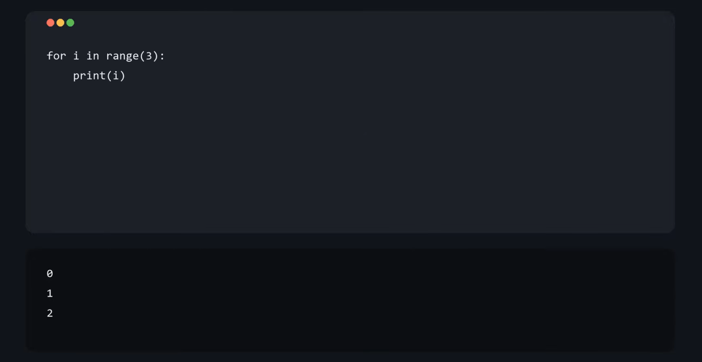

# Codecast

This project turns code and text into a synced narrated video

**▶️[Watch the demo](https://www.youtube.com/watch?v=3hekBi8Fxcs)**

## Features

- Has a user interface where you type out each scene into boxes instead of editing files by hand
- Supports multiple scenes that get merged into one video
- Lets you go back and edit earlier scenes before exporting the video
- Lets you choose where to save the finished video

## Why did I build this project?

Making coding videos is hard, you need to come up with a curriculum to teach, type everything out, record a voice over, and make sure both elements are aligned.  Codecast does all of this automatically from a single file so you can focus more on teaching

## Requirements
- **Python 3** - make sure it is installed
- **FFmpeg** - this is a seperate program (not a python package) so install it on your device
  - **Windows:** `winget install Gyan.FFmpeg`
  - **Mac:** `brew install ffmpeg`
  - **Linux:** `sudo apt install ffmpeg`

## How to run it
1. **Clone the repo**
```
 git clone https://github.com/ompanem/Codecast.git
 cd Codecast
```
2. **Install the python packages**
```
pip install -r requirements.txt
```
3. **Run it**
```
python ui.py
```
4. **Make your video**

In the window that opens up, type your code, narration, and expected output for each scene.  Click **Next Scene** to add more scenes, **Previous Scene** to go back and edit scenes, then **Export Video** to choose where to save your finished video.